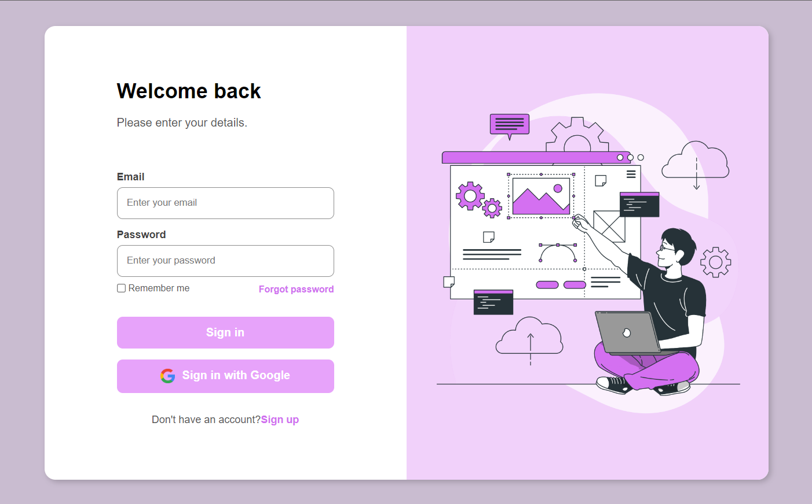

# Página de Login Estática

Esta é uma demonstração de uma página de login estática, produzida com HTML e CSS para fins de estudo.

## Conteúdos Aplicados

### HTML

- Estrutura semântica de tags

### CSS

- Conceito e aplicação de BoxModel
- Conceito e aplicação de FlexBox
- Responsividade com Media Queries
- Padrão de nomenclatura de classes BEM

### Deployment

- Deploy no Netlify para hospedagem e disponibilização online

## Demonstração

Clique [aqui](https://loginpage-rafgpereira.netlify.app/) para acessar a página online ou veja as capturas de tela abaixo.

### Página Web

### Página Mobile

